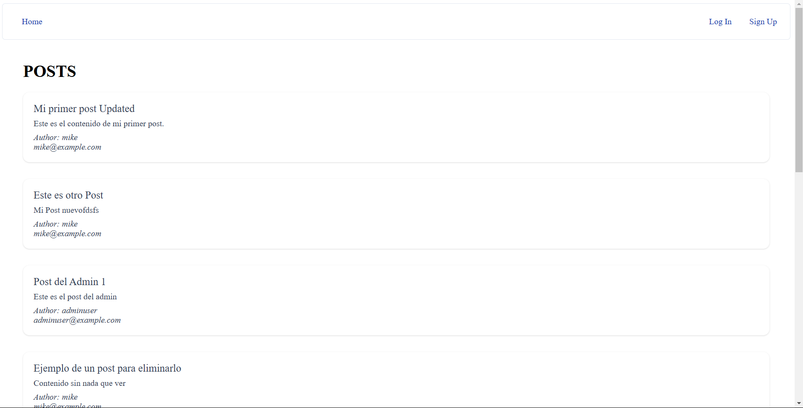

# POST MANAGER PROJECT (TECHNICAL TEST)

**Description**: This project is a technical test for a job, built with Spring Boot (Backend) and Angular (Frontend). It involves several technical requirements such as JPARepository, Hibernate, Liquibase for database management, JWT authentication, LocalStorage for session management, and more.

---

## Table of Contents
- [Prerequisites](#prerequisites)
- [Installation](#installation)
- [Backend Setup (Spring Boot)](#backend-setup-spring-boot)
- [Frontend Setup (Angular)](#frontend-setup-angular)
- [Features](#features)
- [Demo](#demo)
- [IMPORTANT](#important)

---

## Prerequisites
Before getting started, ensure you have the following installed on your machine:
- **Java 17+** (for Spring Boot)
- **Node.js** and **npm** (for Angular)
- **SQL Server** 
- **Visual Studio Code** or other IDE 

---

## Installation

### Backend (Spring Boot)
1. Clone the repository:
   ```bash
   git clone https://github.com/MikeEncalada/PostMangerProject.git
   cd Technical-Challenge
   ```
2. Create a database with the name "TechnicalChallenge" or other name that you can configure in Application.Properties, the same with the user and password for the database
4. Build and run Springboot from your IDE
   
### Frontend (Angular)
1. Navigate to the Angular Project:
   ```bash
   cd Technical-Challenge-Frontend/frontend-technical-challenge
   ```
2. Install dependencies:
   ```bash
   npm install
   ```
3. Run the Angular application:
   ```bash
   npm start
   ```

## Backend Setup (Spring Boot)

The backend is built using **Spring Boot** with the following key technologies:

- **JPARepository** for database access.
- **Hibernate** as the ORM for managing entities and relationships.
- **JWT (JSON Web Tokens)** for secure authentication and authorization.
- **Liquibase** for managing database migrations.

Ensure your database is set up and configure the connection in `application.properties`

## Frontend Setup (Angular)

The frontend is built using Angular with HTTP client to interact with the backend. The app uses LocalStorage to persist user sessions and handle authentication tokens.

## Features

- User authentication with JWT (Login/Register).
- Role-based access control (Admin/User).
- CRUD operations for managing resources.
- Database migrations using Liquibase.
- Real-time features (implemented with Signals).

## Demo

This section will show images of the application.

### Public Post (No authentication)



### Login


### Sign Up


### User Post (Role User)


### Create Post (Role User or Admin)


### Update Post (Role User or Admin)


### Admin Option (Role Admin)


## IMPORTANT 

- There is a default user with credentialas **email: defaultAdminUser** and **password: encryptedpassword**
- There is not management for user and roles (I ran out of time.)


   
